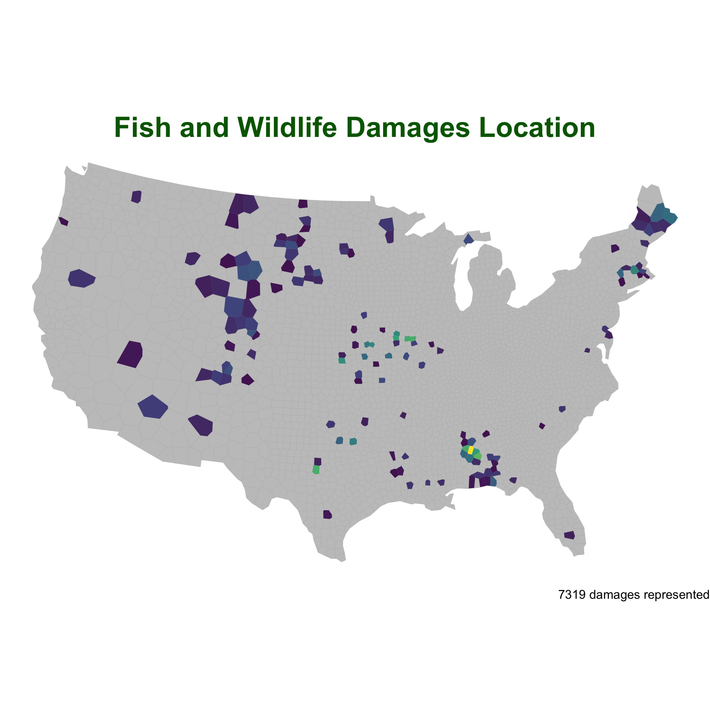

As a grography major, I took this GIS class as a requirement. I didn't know how powerful it is until I got my hands on it. 

---

## [my project website](https://suchaoxi.github.io/geog176a_2020/index.html)

- I learned how to create new files/directory from a different route.
- I learned how to built a static users site with Gibhub Pages.
- I learned how to includes a github repo fro access to all the code.

---

## [Exploring Covid-19 Data](https://suchaoxi.github.io/geog-176A-labs/lab-02.html)

- Learned how to use tidyverse and dplyr to process data
- Learned how to join data sets
- Learned how to plot data with ggplot
- Learned how to use weighted mean

---

## [Distances and Projections](https://suchaoxi.github.io/geog-176A-labs/lab-03.html)

- Learned using tidyverse and sf to gather spatial data
- Learned to create visuals using gghighlight
- Learned to calculate distance of different cities to borders

---

## [Tesselations, Point-in-Polygon](https://suchaoxi.github.io/geog-176A-labs/lab-04.html)

- Learned to code different tesselations and understand the pros and cons of using each.
- Learned to analyze data with a specific tesselation
- Learned to perform analysis with point-in-polygon
- Learned to write my own functions
- Learned to create a leaflet interactive map

---

## [Rasters and Remote Sensing](https://suchaoxi.github.io/geog-176A-labs/lab-05.html)

- Learned to generate rasters 
- Learned to threshold data
- Learned to create RGB with Landsat 8 Operational Land Imager
- Learned to use kmeans rasters

---

## [Flood Risk in Mission Creek: Past, Present, Future](https://suchaoxi.github.io/geog-176A-labs/lab-06.html)
- Learned to read data from Open StreetMap and USGS
- Learned to create hillshade and HAND rasters with whitebox
- Learned to create animated plot