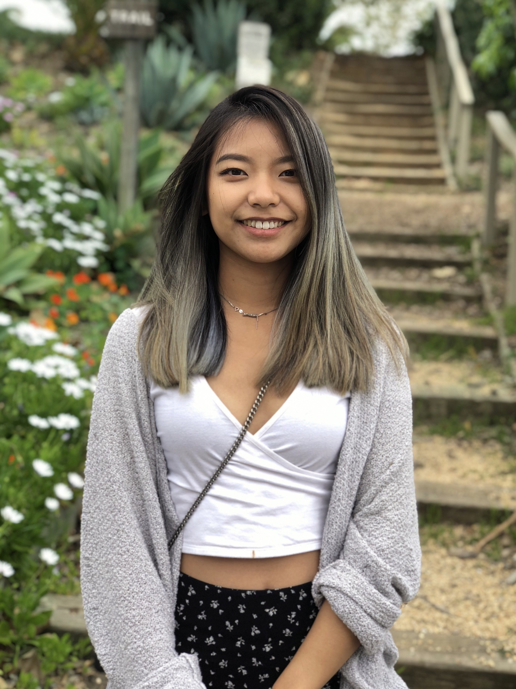

# Hi, Chelsey Su it is.

  Welcome to the very first website in my life! My name is Chelsey Su. I'm currently majoring in Geography in UC Santa Barbara. I love singing, taking photos, playing, and listening to Ted Talks. Just like everyone else, baking had become one of my hobbies during this pandemic. 

  As an immigrant, my family moved to Los Angeles over 10 years ago from Shanghai, China. Unlike other immigrants had culture shocks on tipping or not much high rise, I was shocked by how big the Chinese community is in Los Angeles. Now that I have been living here for quite a time, I still love exploring the city, the culture, the language and the people. 

Find me on [Facebook](https://www.facebook.com/chelsey.y.su) or [Instagram](https://www.instagram.com/suchaoxi/?hl=en)

Here's a photo of me.

